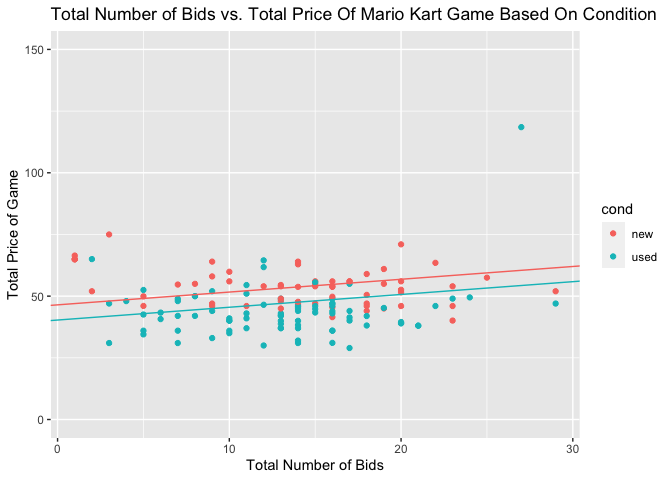

Nina Hernandez
================

``` r
library(tidyverse)
```

    ## ── Attaching packages ─────────────────────────────────────── tidyverse 1.3.1 ──

    ## ✓ ggplot2 3.3.5     ✓ purrr   0.3.4
    ## ✓ tibble  3.1.4     ✓ dplyr   1.0.7
    ## ✓ tidyr   1.1.3     ✓ stringr 1.4.0
    ## ✓ readr   2.0.1     ✓ forcats 0.5.1

    ## ── Conflicts ────────────────────────────────────────── tidyverse_conflicts() ──
    ## x dplyr::filter() masks stats::filter()
    ## x dplyr::lag()    masks stats::lag()

``` r
library(openintro)
```

    ## Loading required package: airports

    ## Loading required package: cherryblossom

    ## Loading required package: usdata

``` r
library(moderndive)
```

    ## 
    ## Attaching package: 'moderndive'

    ## The following object is masked from 'package:openintro':
    ## 
    ##     evals

``` r
library(mosaic)
```

    ## Registered S3 method overwritten by 'mosaic':
    ##   method                           from   
    ##   fortify.SpatialPolygonsDataFrame ggplot2

    ## 
    ## The 'mosaic' package masks several functions from core packages in order to add 
    ## additional features.  The original behavior of these functions should not be affected by this.

    ## 
    ## Attaching package: 'mosaic'

    ## The following object is masked from 'package:Matrix':
    ## 
    ##     mean

    ## The following object is masked from 'package:openintro':
    ## 
    ##     dotPlot

    ## The following objects are masked from 'package:dplyr':
    ## 
    ##     count, do, tally

    ## The following object is masked from 'package:purrr':
    ## 
    ##     cross

    ## The following object is masked from 'package:ggplot2':
    ## 
    ##     stat

    ## The following objects are masked from 'package:stats':
    ## 
    ##     binom.test, cor, cor.test, cov, fivenum, IQR, median, prop.test,
    ##     quantile, sd, t.test, var

    ## The following objects are masked from 'package:base':
    ## 
    ##     max, mean, min, prod, range, sample, sum

``` r
library(ggpubr)
library(infer)
```

    ## 
    ## Attaching package: 'infer'

    ## The following objects are masked from 'package:mosaic':
    ## 
    ##     prop_test, t_test

## GitHub Documents

A quick glance at a dataset from the fivethrityeight package: mariokart

## Mariokart Auction Data

Brief summary statistics of each variable in the dataset.

``` r
summary(mariokart)
```

    ##        id               duration          n_bids        cond   
    ##  Min.   :1.104e+11   Min.   : 1.000   Min.   : 1.00   new :59  
    ##  1st Qu.:1.404e+11   1st Qu.: 1.000   1st Qu.:10.00   used:84  
    ##  Median :2.205e+11   Median : 3.000   Median :14.00            
    ##  Mean   :2.235e+11   Mean   : 3.769   Mean   :13.54            
    ##  3rd Qu.:2.954e+11   3rd Qu.: 7.000   3rd Qu.:17.00            
    ##  Max.   :4.001e+11   Max.   :10.000   Max.   :29.00            
    ##                                                                
    ##     start_pr         ship_pr          total_pr            ship_sp  
    ##  Min.   : 0.010   Min.   : 0.000   Min.   : 28.98   standard  :33  
    ##  1st Qu.: 0.990   1st Qu.: 0.000   1st Qu.: 41.17   upsGround :31  
    ##  Median : 1.000   Median : 3.000   Median : 46.50   priority  :23  
    ##  Mean   : 8.777   Mean   : 3.144   Mean   : 49.88   firstClass:22  
    ##  3rd Qu.:10.000   3rd Qu.: 4.000   3rd Qu.: 53.99   parcel    :16  
    ##  Max.   :69.950   Max.   :25.510   Max.   :326.51   media     :14  
    ##                                                     (Other)   : 4  
    ##   seller_rate     stock_photo     wheels     
    ##  Min.   :     0   no : 38     Min.   :0.000  
    ##  1st Qu.:   109   yes:105     1st Qu.:0.000  
    ##  Median :   820               Median :1.000  
    ##  Mean   : 15898               Mean   :1.147  
    ##  3rd Qu.:  4858               3rd Qu.:2.000  
    ##  Max.   :270144               Max.   :4.000  
    ##                                              
    ##                                                      title   
    ##  BRAND NEW NINTENDO MARIO KART WITH 2 WHEELS            :23  
    ##  Mario Kart Wii (Wii)                                   :19  
    ##  BRAND NEW NINTENDO 1 WII MARIO KART WITH 2 WHEELS +GAME: 8  
    ##  Mario Kart Wii (GAME ONLY/NO WHEEL) - Nintendo Wii Game: 4  
    ##  Mario Kart Wii (Wii) Nintendo Wii game *--WOW --AWESOME: 4  
    ##  (Other)                                                :84  
    ##  NA's                                                   : 1

## Scatter Plot: Comparing Two Variables in Dataframe

This plot shows the relationship between the total number of bids a
mario kart game received and the total price that game sold for, for
both used and new condition mario kart games.

    ## 
    ## Call:
    ## lm(formula = total_pr ~ n_bids + cond, data = mariokart)
    ## 
    ## Residuals:
    ##     Min      1Q  Median      3Q     Max 
    ## -20.157  -8.333  -3.320   1.847 274.778 
    ## 
    ## Coefficients:
    ##             Estimate Std. Error t value Pr(>|t|)    
    ## (Intercept)  46.4699     6.1096   7.606 3.74e-12 ***
    ## n_bids        0.5190     0.3647   1.423    0.157    
    ## condused     -6.1549     4.3401  -1.418    0.158    
    ## ---
    ## Signif. codes:  0 '***' 0.001 '**' 0.01 '*' 0.05 '.' 0.1 ' ' 1
    ## 
    ## Residual standard error: 25.48 on 140 degrees of freedom
    ## Multiple R-squared:  0.03025,    Adjusted R-squared:  0.01639 
    ## F-statistic: 2.183 on 2 and 140 DF,  p-value: 0.1165

<!-- -->

Note that the `echo = FALSE` parameter was added to the code chunk to
prevent printing of the R code that generated the plot.
